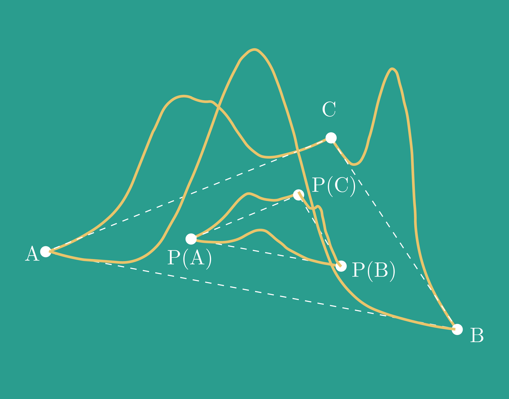

# Cycle Consistent Model Merging

<p align="center">
    <a href="https://arxiv.org/abs/2405.17897"></a>
    <a href="https://www.python.org/downloads/"></a>
    <a href="https://black.readthedocs.io/en/stable/"></a>
</p>



Merging models in a cycle-consistent fashion.

## Development installation

Setup the development environment:

```bash
git clone git@github.com:crisostomi/cycle-consistent-model-merging.git
cd cycle-consistent-model-merging
uv sync
```

Run the tests:

```bash
pytest -v
```

## Usage

All the scripts can be found under `src/scripts/`. Each script has a corresponding configuration file in `conf/matching` where you can change stuff as dataset and model to use. 

### Training 
You can train models using `train.py` with a dataset and model of your choice. 

### Matching two models

1. get the permutations to align the two models (identified by their seed in the config) by running `match_two_models.py`. The config is `conf/matching.yaml` (see inside the config to see the subconfigs).
2. evaluate the interpolation of the models using `evaluate_matched_models.py` and the same config used for the previous step. Be sure to have `matching.yaml` as config in the script itself.

To change the matching technique, you have to change the `matcher` in `conf/matching/match_two_models.yaml`. Each matcher has its own config file in `conf/matching/matcher/`.

To run all the pairs of models with different seeds, run `shell_scripts/run_all_seeds.sh`.

### Matching multiple models

1. get the permutations to align the models (identified by their seed in the config) by running `match_n_models.py`. The config is `conf/matching_n_models.yaml` (see inside the config to see the subconfigs).
2. evaluate the interpolation of the models using `evaluate_matched_models.py` and the same config used for the previous step.  Be sure to have `matching_n_models.yaml` as config in the script itself.

To change the matching technique, you have to change the `matcher` in `conf/matching/match_n_models.yaml`. Each matcher has its own config file in `conf/matching/matcher/`.

### Merging models

1. get the merged model by running `merge_n_models.py`.
2. evaluate the merged model using `evaluate_merged_model.py` and the same config used for the previous step.

To change the merging technique, you have to change the `merger` in `conf/matching/merge_n_models.yaml`. Each merger has its own config file in `conf/matching/merger/`.


### Reproducing the paper

#### Merging an increasing number of models

To reproduce the scaling experiment in Figure 7, use script `scripts/scaling_merging.py`.  

#### 